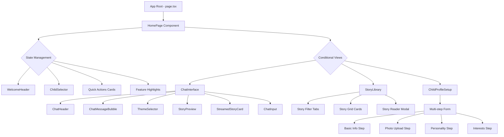
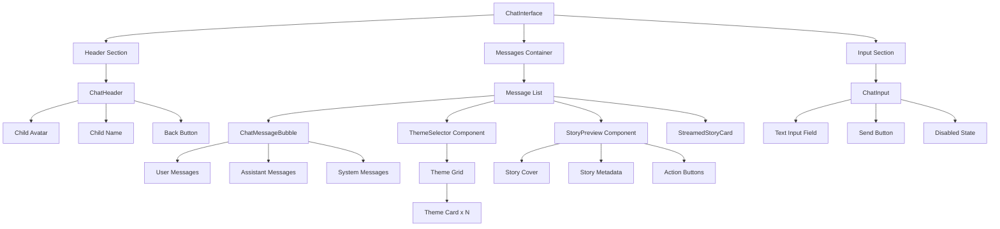
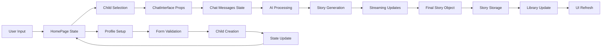

# Component Architecture Diagrams

## Page Structure Overview

```mermaid
graph TB
    A[App Root - page.tsx] --> B[HomePage Component]
    B --> C{State Management}
    
    C --> D[WelcomeHeader]
    C --> E[ChildSelector]
    C --> F[Quick Actions Cards]
    C --> G[Feature Highlights]
    
    B --> H{Conditional Views}
    H --> I[ChatInterface]
    H --> J[StoryLibrary] 
    H --> K[ChildProfileSetup]
    
    I --> L[ChatHeader]
    I --> M[ChatMessageBubble]
    I --> N[ThemeSelector]
    I --> O[StoryPreview]
    I --> P[StreamedStoryCard]
    I --> Q[ChatInput]
    
    J --> R[Story Filter Tabs]
    J --> S[Story Grid Cards]
    J --> T[Story Reader Modal]
    
    K --> U[Multi-step Form]
    U --> V[Basic Info Step]
    U --> W[Photo Upload Step]
    U --> X[Personality Step]
    U --> Y[Interests Step]
```

## Component Hierarchy - Chat Interface

```mermaid
graph TD
    A[ChatInterface] --> B[Header Section]
    A --> C[Messages Container]
    A --> D[Input Section]
    
    B --> E[ChatHeader]
    E --> F[Child Avatar]
    E --> G[Child Name]
    E --> H[Back Button]
    
    C --> I[Message List]
    I --> J[ChatMessageBubble]
    I --> K[ThemeSelector Component]
    I --> L[StoryPreview Component]
    I --> M[StreamedStoryCard]
    
    J --> N[User Messages]
    J --> O[Assistant Messages]
    J --> P[System Messages]
    
    K --> Q[Theme Grid]
    Q --> R[Theme Card x N]
    
    L --> S[Story Cover]
    L --> T[Story Metadata]
    L --> U[Action Buttons]
    
    D --> V[ChatInput]
    V --> W[Text Input Field]
    V --> X[Send Button]
    V --> Y[Disabled State]
```

## Component Data Flow

```mermaid
graph LR
    A[User Input] --> B[HomePage State]
    B --> C[Child Selection]
    C --> D[ChatInterface Props]
    
    D --> E[Chat Messages State]
    E --> F[AI Processing]
    F --> G[Story Generation]
    G --> H[Streaming Updates]
    H --> I[Final Story Object]
    
    I --> J[Story Storage]
    J --> K[Library Update]
    K --> L[UI Refresh]
    
    B --> M[Profile Setup]
    M --> N[Form Validation]
    N --> O[Child Creation]
    O --> P[State Update]
    P --> B
```