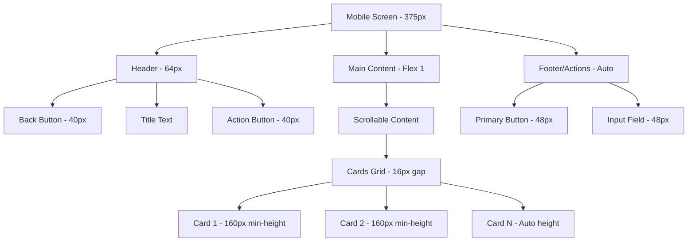
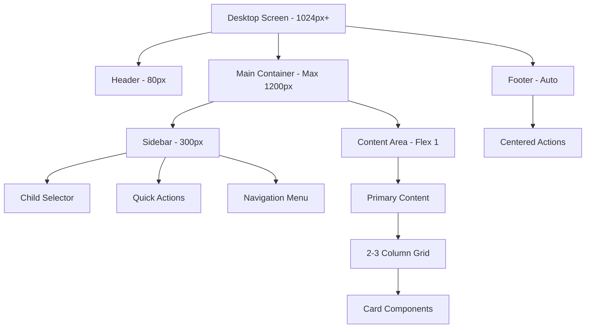
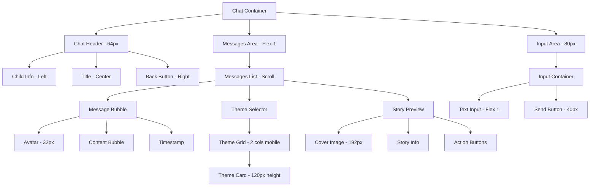
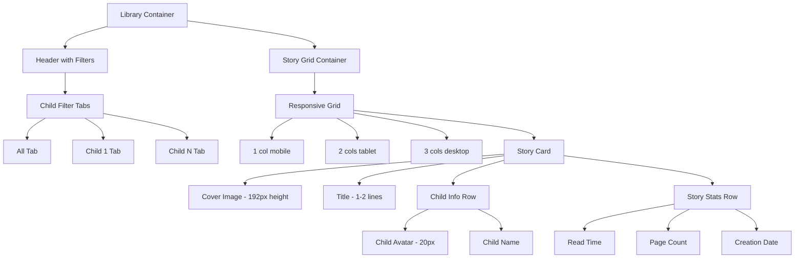
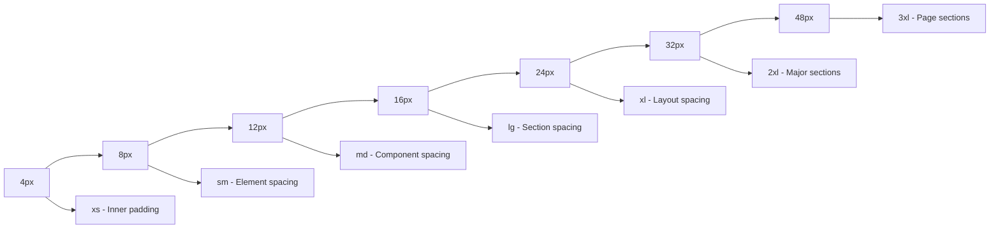

# UI Wireframes and Layout Diagrams

## Mobile Layout Structure

```mermaid
graph TD
    A[Mobile Screen - 375px] --> B[Header - 64px]
    A --> C[Main Content - Flex 1]
    A --> D[Footer/Actions - Auto]
    
    B --> E[Back Button - 40px]
    B --> F[Title Text]
    B --> G[Action Button - 40px]
    
    C --> H[Scrollable Content]
    H --> I[Cards Grid - 16px gap]
    I --> J[Card 1 - 160px min-height]
    I --> K[Card 2 - 160px min-height]
    I --> L[Card N - Auto height]
    
    D --> M[Primary Button - 48px]
    D --> N[Input Field - 48px]
```

## Desktop Layout Structure

```mermaid
graph TD
    A[Desktop Screen - 1024px+] --> B[Header - 80px]
    A --> C[Main Container - Max 1200px]
    A --> D[Footer - Auto]
    
    C --> E[Sidebar - 300px]
    C --> F[Content Area - Flex 1]
    
    E --> G[Child Selector]
    E --> H[Quick Actions]
    E --> I[Navigation Menu]
    
    F --> J[Primary Content]
    J --> K[2-3 Column Grid]
    K --> L[Card Components]
    
    D --> M[Centered Actions]
```

## Chat Interface Layout

```mermaid
graph TD
    A[Chat Container] --> B[Chat Header - 64px]
    A --> C[Messages Area - Flex 1]
    A --> D[Input Area - 80px]
    
    B --> E[Child Info - Left]
    B --> F[Title - Center]
    B --> G[Back Button - Right]
    
    C --> H[Messages List - Scroll]
    H --> I[Message Bubble]
    I --> J[Avatar - 32px]
    I --> K[Content Bubble]
    I --> L[Timestamp]
    
    H --> M[Theme Selector]
    M --> N[Theme Grid - 2 cols mobile]
    N --> O[Theme Card - 120px height]
    
    H --> P[Story Preview]
    P --> Q[Cover Image - 192px]
    P --> R[Story Info]
    P --> S[Action Buttons]
    
    D --> T[Input Container]
    T --> U[Text Input - Flex 1]
    T --> V[Send Button - 40px]
```

## Story Library Grid Layout

```mermaid
graph TD
    A[Library Container] --> B[Header with Filters]
    A --> C[Story Grid Container]
    
    B --> D[Child Filter Tabs]
    D --> E[All Tab]
    D --> F[Child 1 Tab]
    D --> G[Child N Tab]
    
    C --> H[Responsive Grid]
    H --> I[1 col mobile]
    H --> J[2 cols tablet]
    H --> K[3 cols desktop]
    
    H --> L[Story Card]
    L --> M[Cover Image - 192px height]
    L --> N[Title - 1-2 lines]
    L --> O[Child Info Row]
    L --> P[Story Stats Row]
    
    O --> Q[Child Avatar - 20px]
    O --> R[Child Name]
    
    P --> S[Read Time]
    P --> T[Page Count]
    P --> U[Creation Date]
```

## Component Spacing System

```mermaid
graph LR
    A[4px] --> B[8px]
    B --> C[12px] 
    C --> D[16px]
    D --> E[24px]
    E --> F[32px]
    F --> G[48px]
    
    A --> H[xs - Inner padding]
    B --> I[sm - Element spacing]
    C --> J[md - Component spacing]
    D --> K[lg - Section spacing]
    E --> L[xl - Layout spacing]
    F --> M[2xl - Major sections]
    G --> N[3xl - Page sections]
```