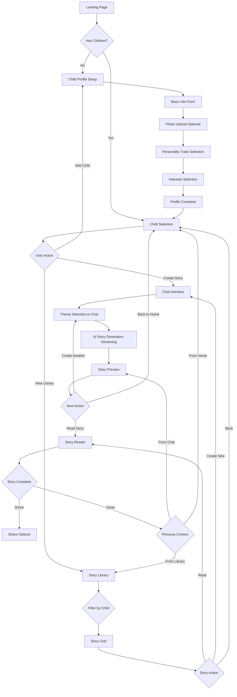
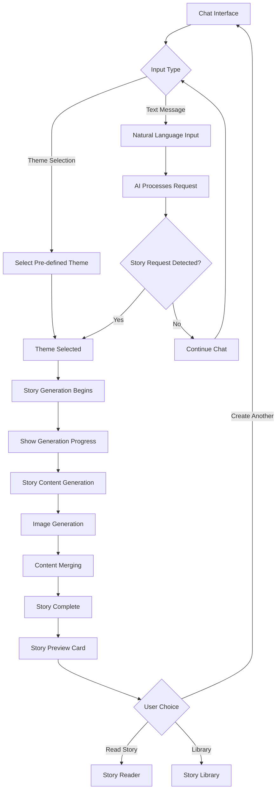
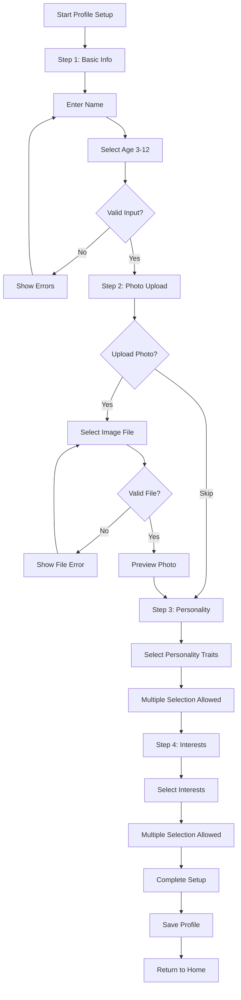

# User Flow Diagrams

## Main Application Flow

```mermaid
flowchart TD
    A[Landing Page] --> B{Has Children?}
    B -->|No| C[Child Profile Setup]
    B -->|Yes| D[Child Selection]
    
    C --> E[Basic Info Form]
    E --> F[Photo Upload Optional]
    F --> G[Personality Traits Selection]
    G --> H[Interests Selection]
    H --> I[Profile Complete]
    I --> D
    
    D --> J{User Action}
    J -->|Create Story| K[Chat Interface]
    J -->|View Library| L[Story Library]
    J -->|Add Child| C
    
    K --> M[Theme Selection or Chat]
    M --> N[AI Story Generation Streaming]
    N --> O[Story Preview]
    O --> P{Next Action}
    P -->|Read Story| Q[Story Reader]
    P -->|Create Another| M
    P -->|Back to Home| D
    
    L --> R{Filter by Child}
    R --> S[Story Grid]
    S --> T{Story Action}
    T -->|Read| Q
    T -->|Create New| K
    T -->|Back| D
    
    Q --> U{Story Complete}
    U -->|Share| V[Share Options]
    U -->|Close| W{Previous Context}
    W -->|From Library| L
    W -->|From Chat| O
    W -->|From Home| D
```

## Story Creation Flow

```mermaid
flowchart TD
    A[Chat Interface] --> B{Input Type}
    B -->|Theme Selection| C[Select Pre-defined Theme]
    B -->|Text Message| D[Natural Language Input]
    
    C --> E[Theme Selected]
    D --> F[AI Processes Request]
    F --> G{Story Request Detected?}
    G -->|Yes| E
    G -->|No| H[Continue Chat]
    H --> B
    
    E --> I[Story Generation Begins]
    I --> J[Show Generation Progress]
    J --> K[Story Content Generation]
    K --> L[Image Generation]
    L --> M[Content Merging]
    M --> N[Story Complete]
    
    N --> O[Story Preview Card]
    O --> P{User Choice}
    P -->|Read Story| Q[Story Reader]
    P -->|Create Another| A
    P -->|Library| R[Story Library]
```

## Child Profile Setup Flow

```mermaid
flowchart TD
    A[Start Profile Setup] --> B[Step 1: Basic Info]
    B --> C[Enter Name]
    C --> D[Select Age 3-12]
    D --> E{Valid Input?}
    E -->|No| F[Show Errors]
    F --> C
    E -->|Yes| G[Step 2: Photo Upload]
    
    G --> H{Upload Photo?}
    H -->|Yes| I[Select Image File]
    I --> J{Valid File?}
    J -->|No| K[Show File Error]
    K --> I
    J -->|Yes| L[Preview Photo]
    H -->|Skip| M[Step 3: Personality]
    L --> M
    
    M --> N[Select Personality Traits]
    N --> O[Multiple Selection Allowed]
    O --> P[Step 4: Interests]
    
    P --> Q[Select Interests]
    Q --> R[Multiple Selection Allowed]
    R --> S[Complete Setup]
    S --> T[Save Profile]
    T --> U[Return to Home]
```